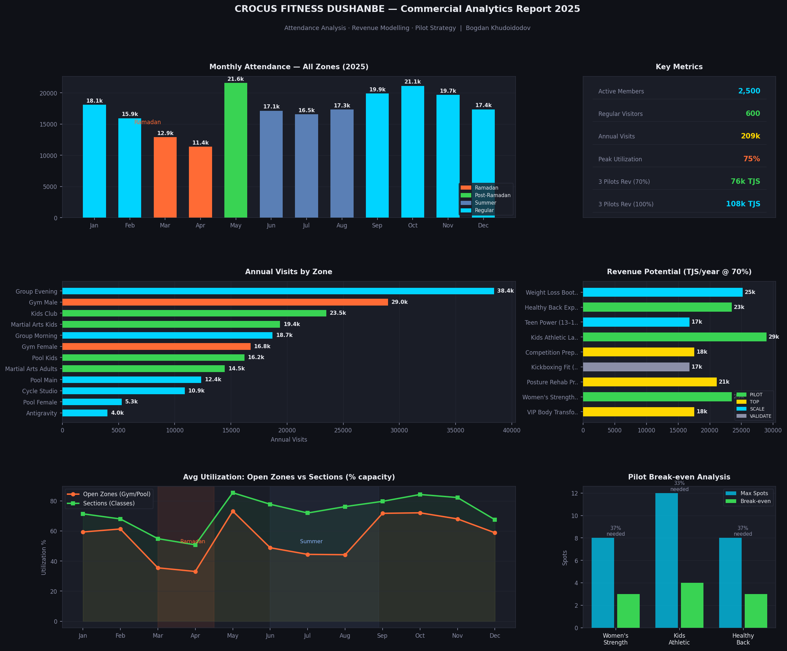

# Crocus Fitness Dushanbe — Commercial Analytics Report 2025

> **Python · Pandas · Matplotlib · Plotly · Data Modelling · Business Analytics**

---

## About the Company

**Crocus Fitness** is the flagship fitness brand of **Crocus Group** — one of the largest privately held conglomerates in the CIS region, founded by Aras Agalarov. The group operates across real estate, retail (Crocus City Mall), hospitality, and entertainment at an international scale.

Crocus Fitness Dushanbe is the **premium fitness club in Tajikistan**, operating under the Crocus Group brand with a full-service facility: gym zones (male/female), 3 pools, martial arts hall, group class studios (Antigravity, Cycle, Yoga, Dance), kids club, and spa. The club serves **~2,500 active members** and operates across **11 zones** with a professional trainer staff of 20+.

Working as an **Operations Analyst Intern** at this facility provided direct access to operational data, pricing structures, and scheduling systems — the foundation of this project.

---

## Project Overview

This project is a **commercial revenue strategy analysis** built on real operational data from Crocus Fitness Dushanbe. The goal: identify underutilised revenue opportunities and model a pilot launch strategy for commercial group programs.

**Business question:** *Which commercial class formats should the club launch first, and what revenue can realistically be expected?*

---

## Key Findings

| Metric | Value |
|---|---|
| Active club members | 2,500 |
| Regular visitors | 600 |
| Annual zone visits (modelled) | ~209,000 |
| Peak daily utilization | 75% (evening prime-time) |
| Programs analysed | 10 |
| Pilots recommended | 3 |
| Combined pilot revenue @ 70% capacity | ~103,000 TJS/year |
| Break-even fill rate (all 3 pilots) | ~37–38% of spots |
| First-cycle ROI estimate | 380%+ |

---

## Data Sources

| Source | Description |
|---|---|
| `Прейскурант_Душанбе.xls` | Official Crocus Fitness Dushanbe price list (Oct 2022) — real pricing for all service categories |
| `БИ__2___РАСПИСАПНИЕ_2026_ВЕСНА_.xlsx` | Martial Arts zone schedule — 10–12 sessions/day, 6 days/week |
| `расписание_гп_РАМАДАН.xlsx` | Group programs schedule during Ramadan — seasonal adjustment baseline |
| `ДЕТСКИЕ_СЕКЦИИ_ВП_ДЕКАБРЬ.xlsx` | Kids swimming sections schedule — 5–6 slots/day |
| `Расписание_ДК__1___2_.xlsx` | Kids club schedule — 8–10 sessions/day |
| Operational data | Member count, daily attendance, utilization — collected during internship |

Attendance dataset is **synthetic but grounded**: generated from real schedule files, real pricing, and real operational observations (2,500 members, 600 regulars, 260 evening / 90 morning peak split, Ramadan and summer seasonality).

---

## Project Structure

```
crocus-fitness-analytics/
│
├── data/
│   ├── attendance_monthly.csv              ← generated by generate_data.py
│   └── crocus_fitness_commercial_EN_2026.xlsx
│
├── outputs/                                ← auto-created on run
│   ├── crocus_dashboard.png                ← static dashboard (matplotlib)
│   └── crocus_dashboard.html               ← interactive dashboard (plotly)
│
├── generate_data.py       ← Step 1: builds attendance CSV from schedule logic
├── analysis.py            ← Step 2: static PNG dashboard (matplotlib)
├── analysis_plotly.py     ← Step 3: interactive HTML dashboard (plotly)
│
├── requirements.txt
├── .gitignore
└── README.md
```

---

## How to Run

```bash
# 1. Clone and install
git clone https://github.com/flatsoup/crocus-fitness-analytics.git
cd crocus-fitness-analytics
pip install -r requirements.txt

# 2. Generate attendance data
python generate_data.py

# 3. Static dashboard (PNG)
python analysis.py

# 4. Interactive dashboard (HTML — open in browser)
python analysis_plotly.py
```

Optional custom output path:
```bash
python analysis.py --output outputs/my_report.png
python analysis_plotly.py --output outputs/my_report.html
```

---

## Dashboard Preview

### Static (Matplotlib)


---

## Tech Stack

| Tool | Usage |
|---|---|
| Python 3.11+ | Core language |
| Pandas | Data loading, cleaning, aggregation |
| NumPy | Seasonality modelling, break-even calculations |
| Matplotlib | Static multi-chart dashboard (6 charts) |
| Plotly | Interactive HTML dashboard with hover/zoom |
| OpenPyXL / xlrd | Reading Excel price lists and schedules |

---

## Analytical Approach

**1. Data Generation (`generate_data.py`)**
Built a synthetic attendance dataset from real schedule files. Each zone modelled separately with:
- Sessions per day from actual timetables
- Average attendance per session from operational observations
- Monthly seasonality coefficients (Ramadan −32%, post-Ramadan +10%, summer −22% for gym zones, +25% for sections)

**2. Revenue Modelling (`analysis.py` / `analysis_plotly.py`)**
- Loaded program data directly from the commercial Excel file (official pricing)
- Calculated revenue at 100% and 70% capacity scenarios
- Computed break-even spots needed per program
- Prioritised pilots by ROI, LTV potential, and operational readiness

**3. Pilot Selection Logic**
Three programs recommended for immediate launch (April 2026, post-Ramadan peak):

| Program | Format | Spots | Price (TJS) | Rev/Cycle | Break-even |
|---|---|---|---|---|---|
| Women's Strength & Sculpt | Mini-group | 8 | 698 | 5,584 | 3 spots (37%) |
| Kids Athletic Lab (6–12) | Kids section | 12 | 575 | 6,900 | 5 spots (38%) |
| Healthy Back Express | Mini-group | 8 | 698 | 5,584 | 3 spots (37%) |

---

## Author

**Bogdan Khudoidodov**
Data & Business Analyst Intern Candidate
[LinkedIn](https://linkedin.com/in/bogdan-khudoidodov) · [GitHub](https://github.com/flatsoup)
